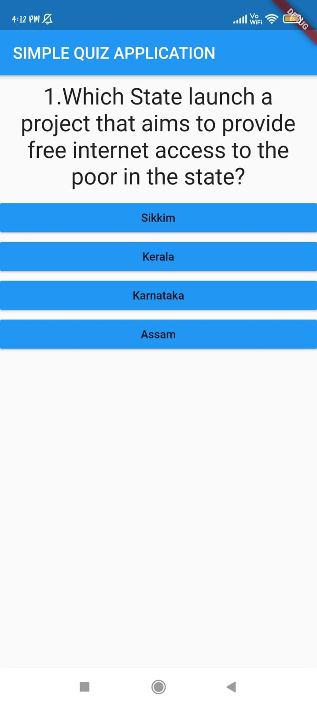
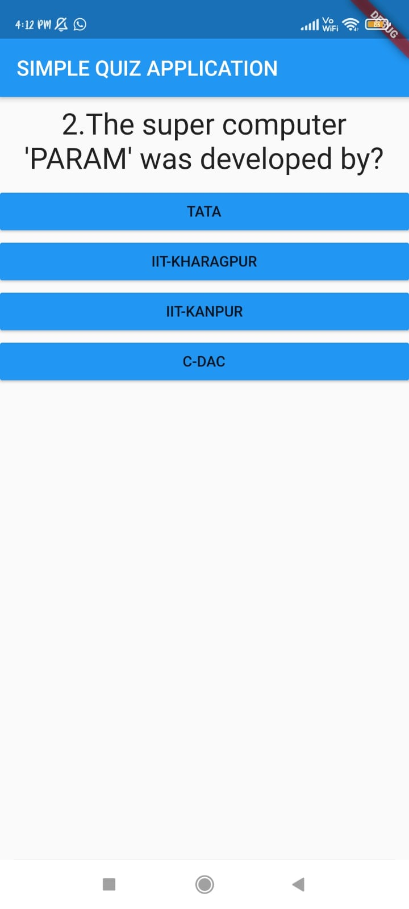
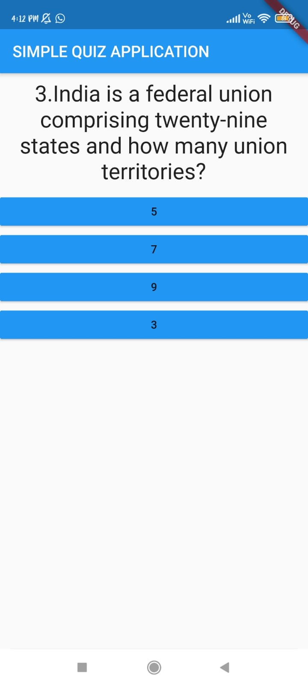
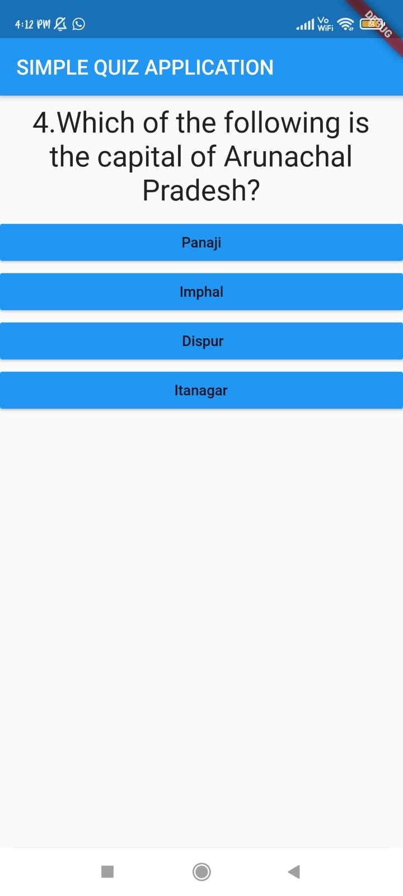
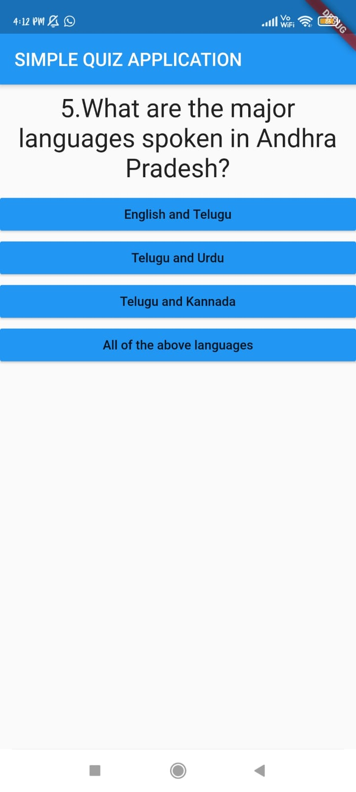
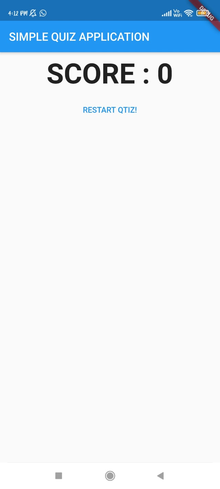

# Simple Quiz App :star_struck:  :iphone:

     

***This new flutter application named 'SIMPLE QUIZ' is created by Biswarup Bhattacharjee, student of BTECH, in University of Engineering and Management, Kolkata.***

**Email Id: bbiswa471@gmail.com.** 

**Contact No: 916290272740.** 

## About :point_down: 
 
This is a simple quiz flutter applicaton. Here are some questions. User has to select answers from multiple choices. There are total 6 questions. After attending the questions the score is shown. 
 
### For some reson the codebase of this application is not found. To know about this app watch the demo video.

## SIMPLE QUIZ DEMO VIDEO: :point_right: <a href="https://www.youtube.com/watch?v=-17PvO4ejNA&list=PL0lbDlMJ1h4hiexZec5cbgw8a3F8dE1HH&index=7">Click here to watch</a>

## FLUTTER PLAYLIST: :point_right: <a href="https://www.youtube.com/playlist?list=PL0lbDlMJ1h4hiexZec5cbgw8a3F8dE1HH">Click here to watch</a>

## SIMPLE QUIZ APP DOWNLOAD LINK : :point_right: <a href="https://drive.google.com/file/d/1qGlCcHXrACDvby4k-yJS-Mq_Ke9n7YyJ/view" download>Click here to download</a>

This project is a starting point for a Flutter application.

A few resources to get you started if this is your first Flutter project:

- [Lab: Write your first Flutter app](https://flutter.dev/docs/get-started/codelab)
- [Cookbook: Useful Flutter samples](https://flutter.dev/docs/cookbook)

For help getting started with Flutter, view our
[online documentation](https://flutter.dev/docs), which offers tutorials,
samples, guidance on mobile development, and a full API reference.

## Screenshots :point_down: 

 
  
 
  

